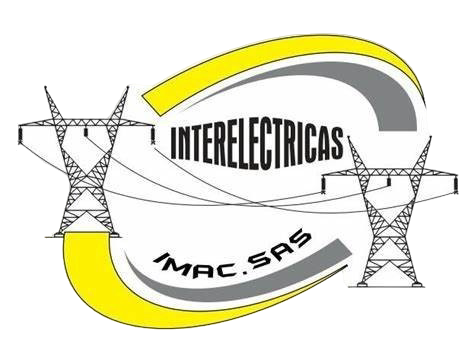

[🇺🇸 Read in English](README.md)

---

# Bienvenidos a Hypereds

**Hypereds** es una startup de desarrollo de software centrada en la creación de soluciones tecnológicas a la medida, con un enfoque en aplicaciones web modernas, desplegadas y gestionadas en la nube.

Nos especializamos en:

- Desarrollo de software personalizado 
- Aplicaciones web escalables 
- Integración de procesos y automatización 
- Infraestructura y despliegue en la nube 

Nuestro objetivo es ofrecer soluciones funcionales, sostenibles y alineadas con las necesidades reales de cada proyecto.

Este espacio en GitHub alojará en el futuro herramientas, utilidades, documentación técnica y desarrollos abiertos o compartidos por nuestro equipo.

**Sitio web oficial:** [www.hypereds.com](https://www.hypereds.com)

---

## Aliados y colaboradores

  
  
  
  

