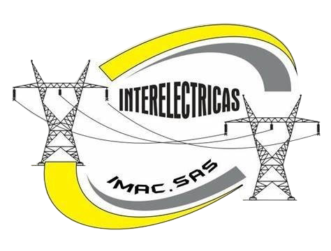

[🇪🇸 Leer en español](README.es.md)

---

# Welcome to Hypereds

**Hypereds** is a software development startup focused on building tailored technology solutions, with an emphasis on modern web applications deployed and managed in the cloud.

We specialize in:

- Custom software development 
- Scalable web applications 
- Process integration and automation 
- Cloud infrastructure and deployment 

Our goal is to deliver functional, sustainable solutions aligned with the real needs of each project.

This GitHub profile will serve as a space for tools, internal utilities, technical documentation, and open or shared developments from our team.

**Official website:** [www.hypereds.com](https://www.hypereds.com)

---

## Partners and Collaborators

  
  
  
  

